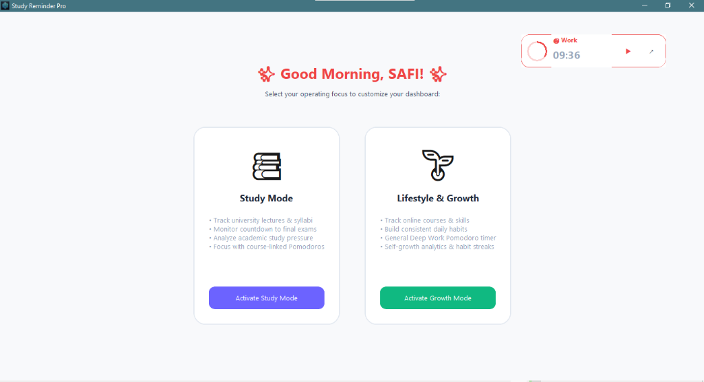
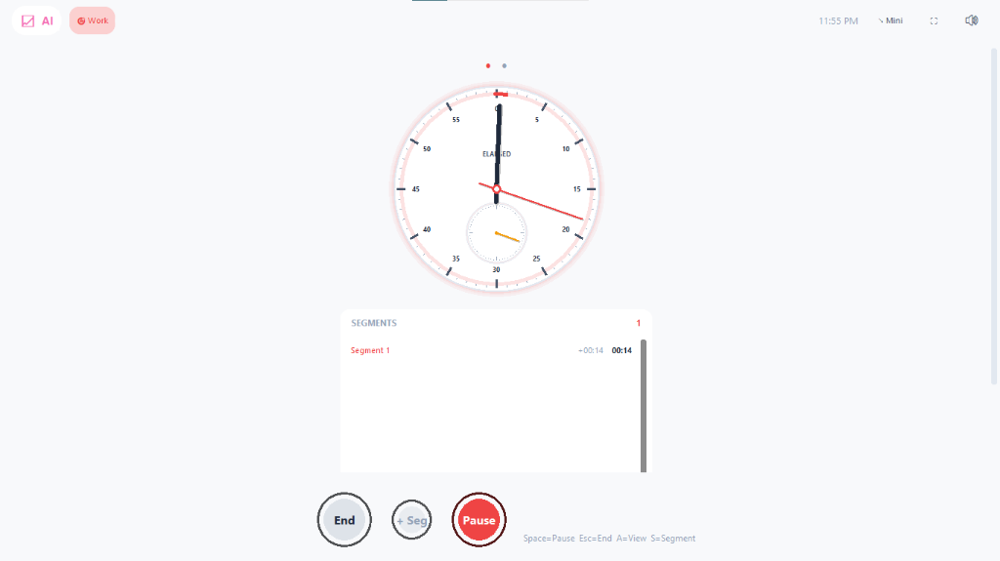
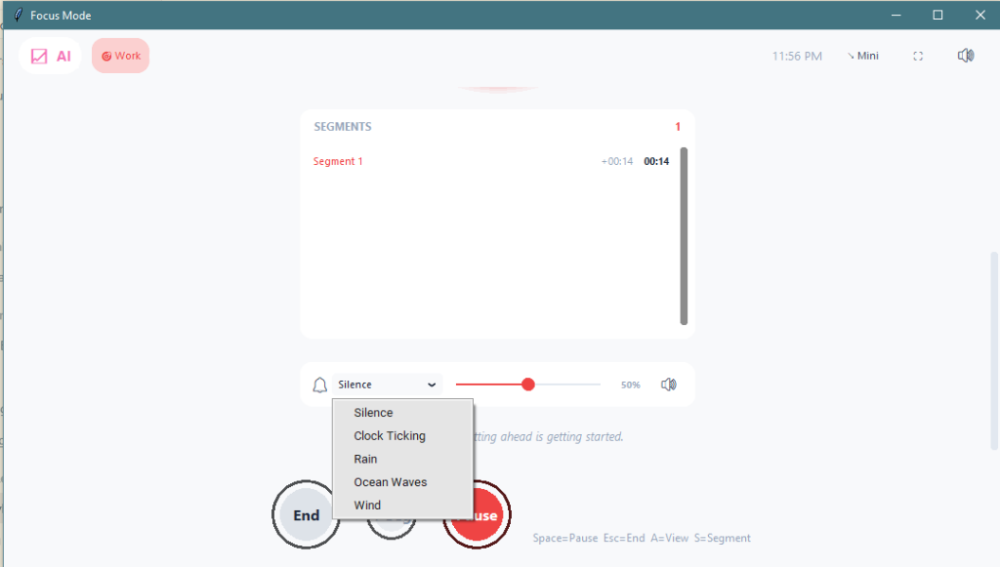
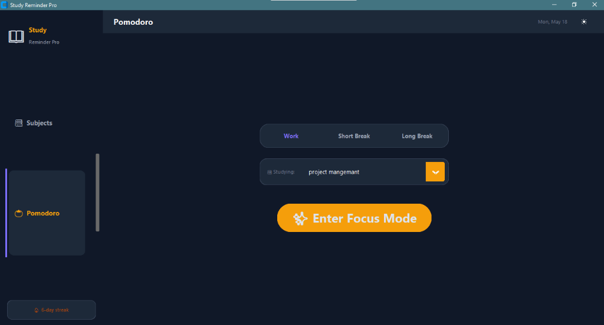
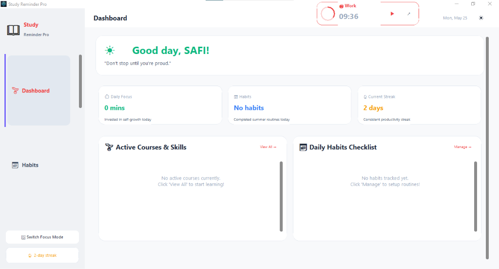
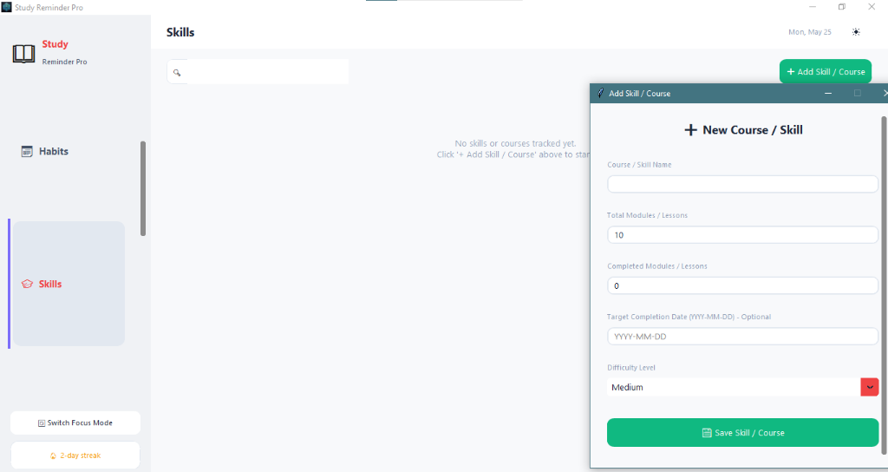
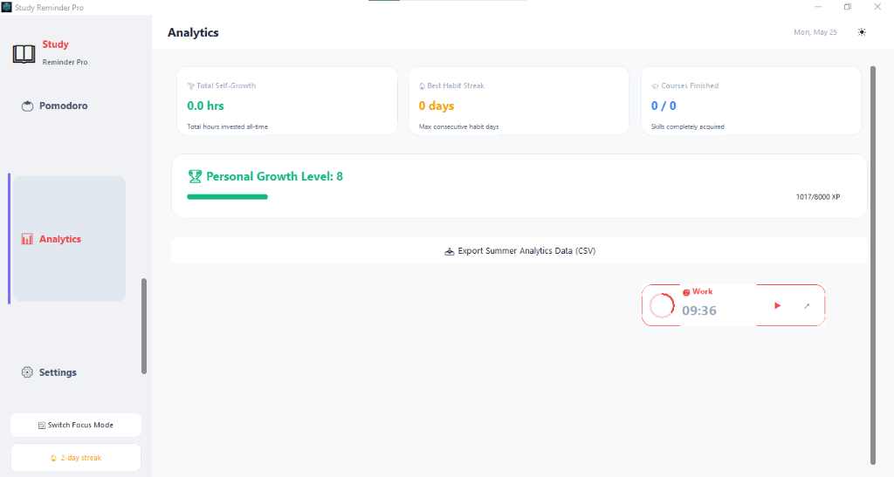

<div align="center">
  

  # 📖 Study Reminder Pro

  **A visually stunning, production-level smart study tracking and reminder application.**<br>
  Designed to boost productivity, track progress, and help university students ace their exams.

  [](https://www.python.org/)
  [](https://github.com/TomSchimansky/CustomTkinter)
  [](https://opensource.org/licenses/MIT)

  [Features](#-features) • [Installation](#-installation) • [Usage](#-usage) • [Screenshots](#-screenshots)

</div>

---

## ✨ Features

Study Reminder Pro is packed with powerful features designed to streamline your study workflow:

| 🚀 Core Features | 📝 Description |
|:---|:---|
| **🎭 Multi-Mode Workspace** | Dynamically switch between **Study Mode** (academics) and **Lifestyle & Growth Mode** (personal habits). |
| **📚 Subject Management** | Track active subjects with customizable icons, colors, progress, and rich notes. |
| **🏆 Course & Skill Builder** | Plan and track modules/lessons for self-study online courses with custom difficulty parameters. |
| **📅 Exam Countdown** | Color-coded badges displaying precise days remaining until each exam. |
| **⏱️ Professional Focus Mode**| Premium iOS-style analog stopwatch, segments logging, progress arcs, and digital clock view. |
| **🎵 Ambient Sound Panel** | Built-in sound machine featuring HQ audio (Rain, Ocean Waves, Clock Ticking) and volume controller. |
| **📊 Advanced Analytics** | Weekly analytics, study trends, best streak metrics, and XP level advancement charts. |
| **🔥 Habits & Streaks** | Interactive daily habit checklist, streak trackers, and dynamic XP leveling. |
| **🌙 Dynamic Themes** | Beautiful Dark / Light mode with a one-click UI toggle. |
| **💾 Robust Data Integrity**| Auto-saves to `data/study_data.json` with a 1-click backup and restore system. |
| **💡 AI-Curated Insights**| Daily actionable study tips displayed on every launch. |

---

## 🚀 Quick Start (Windows)

The easiest way to get started is by using the automated launcher.

**Double-click `run.bat`** — it handles everything automatically:
1. Verifies your Python installation.
2. Installs required dependencies from `requirements.txt`.
3. Launches the application immediately.

---

## 🛠️ Manual Installation & Setup

If you prefer to run the application manually from your terminal, follow these steps:

### 1. Clone the Repository
```bash
git clone https://github.com/yourusername/StudyReminderPro.git
cd StudyReminderPro
```

### 2. Install Dependencies
Make sure you have Python 3.10+ installed.
```bash
pip install -r requirements.txt
```

### 3. Run the App
```bash
python app.py
```

## 📸 Screenshots

### 🎭 Multi-Mode Selection
A beautifully crafted startup screen allowing users to launch the workspace customized for Academics or Personal Self-Growth.

<p align="center">
  
</p>

---

### ⏱️ iOS-Style Focus Stopwatch (Analog Mode)
A masterclass visual analog clock with a secondary minutes sub-dial, a circular progress arc, live elapsed timer, and segments list.

<p align="center">
  
</p>

---

### 🎵 Ambient Sound System & Controls
Equipped with dynamic HQ background audio selectors, a smooth master volume slider, instant mute toggles, and shortcut keys.

<p align="center">
  
</p>

---

### 📚 Study Workspace (Subjects & Pomodoro)
Academic hub loaded with customizable subjects, study notes, target deadlines, and an interactive Pomodoro workspace.

<p align="center">
  
</p>

---

### 🌱 Lifestyle & Growth Dashboard
Fully integrated self-growth panel showcasing dynamic daily checklists, skill cards, and real-time focus timers.

<p align="center">
  
</p>

---

### 📝 Course & Skill Acquisition Panel
Add, edit, track and analyze your online learning progress with a dedicated module counter and completion targets.

<p align="center">
  
</p>

---

### 📈 Gamified Growth Analytics & XP
Track your best streaks, complete hours of deep focus, analyze progress levels, and earn XP to level up your performance.

<p align="center">
  
</p>

---

## 📁 Architecture & Structure

```text
StudyReminderPro/
├── app.py                  # Main Application Entry Point
├── run.bat                 # One-click Windows Launcher
├── requirements.txt        # Python Dependencies
├── core/                   # Core App Logic (Database, Theme, Logic)
├── ui/                     # CustomTkinter Views (Dashboard, Settings, Analytics)
├── data/                   # [Auto-Generated] Local Storage & Backups
└── assets/                 # Icons and Image Assets
```

---

## 📦 Building a Standalone Executable (.exe)

Want to share the app with friends without them needing Python? Use PyInstaller:

```bash
pip install pyinstaller
pyinstaller --onefile --windowed --icon=assets/icon.ico --name="StudyReminderPro" app.py
```
The compiled `.exe` will be generated inside the `dist/` folder.

---

## 💡 Pro Tips for Best Experience
- **Date Formatting:** Always enter exam dates in **YYYY-MM-DD** format (e.g. `2025-06-20`).
- **Quick Logging:** Use the **Quick +1 Lecture** button on each subject card for rapid tracking.
- **Timer Integration:** The Pomodoro timer automatically logs your completed study time to the selected subject.
- **Data Safety:** Regularly backup your data before major updates via **Settings → Backup**.

---

## 📄 License
This project is licensed under the **MIT License** — free to use, modify, and distribute. See the `LICENSE` file for more details.

<div align="center">
  <i>Built with ❤️ for better grades and productive study sessions.</i>
</div>
